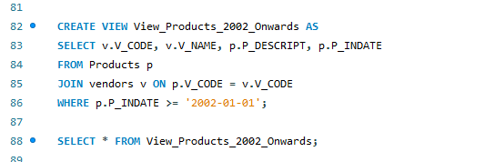

# Final Task 5 - Using SQL views and Stored Procedures and Stored Funtions

## Step by Step

#### Step 1
- CREATE A VIEW that will display the vendors_code, vendors name, product description p_indate, of all products with p_indate from 2002 onwards.

#### Step 2
- CREATE a VIEW that will display all products whose price range is between 100-150.

#### Step 3
- Create a VIEW that will COMPUTE for the (TOTAL_PRICE) of ALL PRODUCTS by getting the (P_ONHAND x P_PRICE) Sold by vendors with the following v_code (21344, 23119 and 24288).

#### Step 4
- CREATE a STORED PROCEDURE that WILL take a SINGLE PARAMETER and UPDATED the Name of Vendor ‘Bryson,Inc.’ to ‘Bryson and Co’.

#### Step 5
- CREATE A Function that will take 2 parameters(v_code and v_state) and display All the product description and price based on the parameters passed to the function.

## Here's the Screenshots

#### Step 1

#### Step 2

#### Step 3

#### Step 4

#### Step 5

